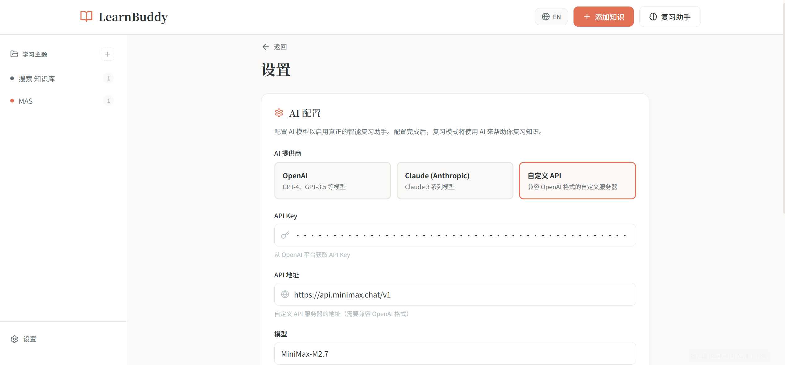

# LearnBuddy 🧠

> Your personal AI-powered knowledge review assistant / 你的个人 AI 智能知识复习助手

English | [中文](#中文说明)

---

## Features / 功能特点

- 🤖 **AI Review Assistant / AI 复习助手** - GPT-4, Claude 3 support
- 📚 **Knowledge Management / 知识管理** - Save, organize, and review your learning materials
- 🌐 **Auto Content Fetch / 自动抓取** - Extract content from any webpage
- 🌏 **Bilingual / 中英双语** - Full Chinese and English support

## Screenshots / 截图

### Knowledge Base / 知识库


### Add Knowledge / 添加知识


### AI Review / AI 复习


### Settings / 设置


## Quick Start / 快速开始

### Prerequisites / 环境要求

- Node.js 18+
- npm or yarn

### Installation / 安装

```bash
# Clone the repository / 克隆仓库
git clone https://github.com/your-username/learn-buddy.git
cd learn-buddy

# Install dependencies / 安装依赖
npm install

# Start development server / 启动开发服务器
npm run dev
```

Open [http://localhost:5173](http://localhost:5173) in your browser.

---

## Usage Guide / 使用指南

### 1. Add Knowledge / 添加知识

1. Click "Add Knowledge" / 点击"添加知识"
2. Enter URL and click "Auto Fetch" / 输入网址，点击"自动抓取"
3. Fill in title, topic, and notes / 填写标题、主题、笔记
4. Click "Save Knowledge" / 点击"保存知识"

### 2. Review with AI / AI 复习

1. Configure AI in Settings (optional) / 在设置中配置 AI（可选）
2. Go to Review page / 进入复习页面
3. Ask questions or let AI quiz you / 提问或让 AI 出题

### 3. Switch Language / 切换语言

Click the 🌐 button in the header to toggle between Chinese and English.

---

## Tech Stack / 技术栈

- React 18 + TypeScript
- Vite
- CSS Modules
- LocalStorage

## License / 许可证

MIT License

---

---

## 中文说明

### 项目简介

LearnBuddy 是一款帮助你管理和复习知识的学习工具。你可以：

- 📝 保存文章、博客、教程等学习资料链接
- 🏷️ 按主题分类管理知识
- 🤖 配置 AI 助手进行智能复习
- 🌐 中英双语界面

### 使用方法

#### 添加知识

1. 点击顶部「添加知识」按钮
2. 输入网页链接，点击「自动抓取」获取内容
3. 填写标题、选择/创建主题
4. 添加学习目标和笔记
5. 点击「保存知识」

#### AI 复习

1. 进入「设置」页面配置 OpenAI 或 Claude API
2. 前往「复习助手」页面
3. 向 AI 提问或让它帮你出题测试

#### 切换语言

点击右上角的 🌐 按钮即可在中英文之间切换。

### 本地运行

```bash
# 克隆项目
git clone https://github.com/your-username/learn-buddy.git
cd learn-buddy

# 安装依赖
npm install

# 启动开发服务器
npm run dev
```

然后在浏览器打开 http://localhost:5173

### 技术栈

- React 18 + TypeScript
- Vite 构建工具
- CSS Modules 样式
- LocalStorage 本地存储

### License

MIT License
