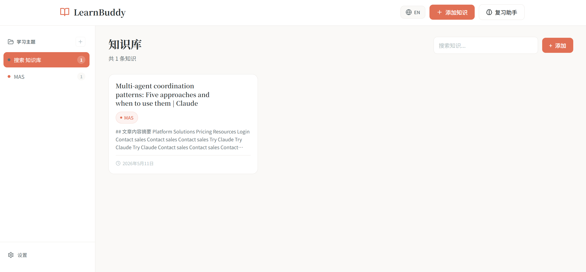
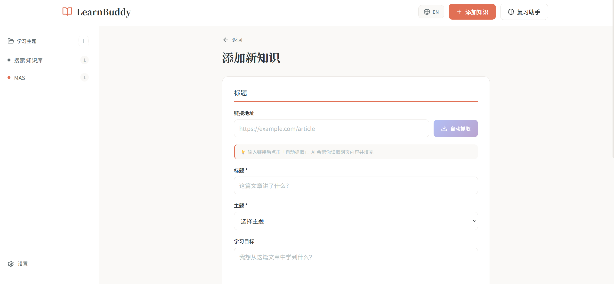
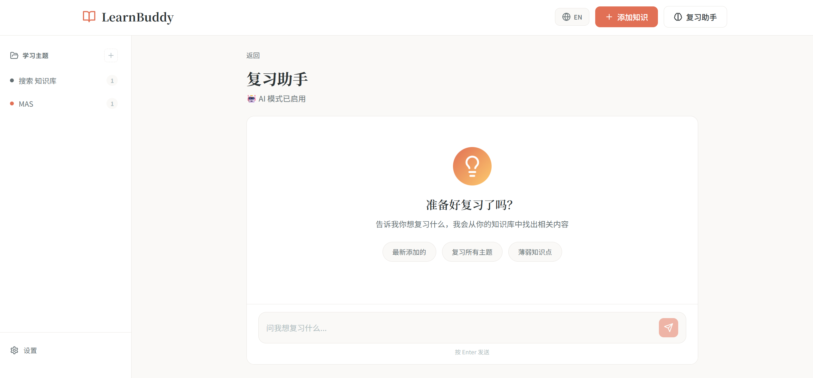

# LearnBuddy 🧠

> 你的个人 AI 智能知识复习助手

[English Version](README.md)

---

## 功能特点

- 🤖 **AI 复习助手** - 支持 GPT-4、Claude 3
- 📚 **知识管理** - 保存、整理和复习你的学习资料
- 🌐 **自动抓取** - 从任何网页提取内容
- 🌏 **中英双语** - 全面的中文和英文支持

## 截图

### 知识库


### 添加知识


### AI 复习


### 设置


## 快速开始

### 环境要求

- Node.js 18+
- npm 或 yarn

### 安装

```bash
# 克隆仓库
git clone https://github.com/your-username/learn-buddy.git
cd learn-buddy

# 安装依赖
npm install

# 启动开发服务器
npm run dev
```

在浏览器中打开 [http://localhost:5173](http://localhost:5173)

---

## 使用指南

### 1. 添加知识

1. 点击侧边栏的「添加知识」
2. 输入网址，点击「自动抓取」提取内容
3. 填写标题、选择/创建主题、添加笔记
4. 点击「保存知识」

### 2. AI 复习

1. 在设置中配置 AI（可选）
2. 进入复习页面
3. 向 AI 提问或让它帮你出题测试

### 3. 切换语言

点击右上角的 🌐 按钮即可在中英文之间切换。

---

## 技术栈

- React 18 + TypeScript
- Vite
- CSS Modules
- LocalStorage

## 许可证

MIT License
